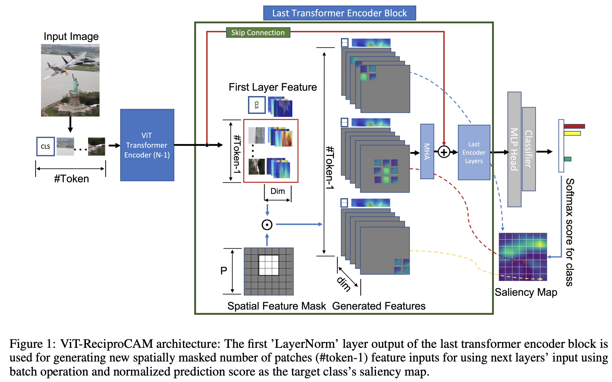
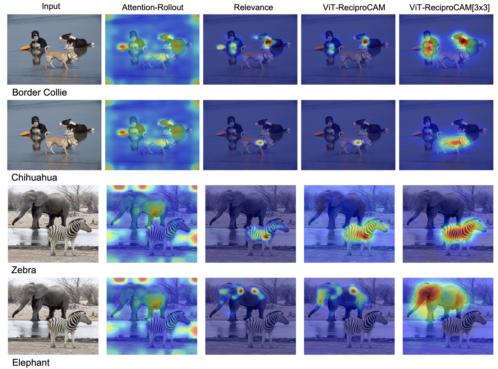
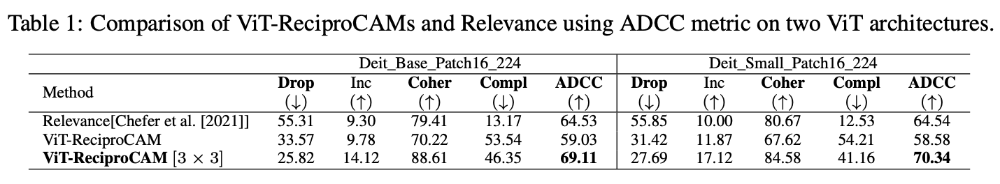

# ViT-ReciproCAM

ViT-ReciproCAM is a gradient-free and attention-independent visual explanation method designed for Vision Transformers (ViTs). It enhances the interpretability of ViT models by generating localized saliency maps without relying on attention matrices or gradient information.:

> **ViT-ReciproCAM: [ViT-ReciproCAM: Gradient and Attention-Free Visual Explanations for Vision Transformer](https://arxiv.org/pdf/2310.02588)**  
> *Authors: Seok-Yong Byun, Wonju Lee*  
> Pre-printed in: Arxiv 2023

## Introduction

Vision Transformers have demonstrated superior performance in various computer vision tasks, including image classification and object detection. However, understanding their prediction processes and debugging errors remain challenging due to their complex architectures. Existing explainability methods often depend on attention mechanisms or gradient computations, which can be computationally intensive and complex to implement.

ViT-ReciproCAM addresses these challenges by utilizing token masking and generating new layer outputs from the target layer's input. This approach exploits the correlation between activated tokens and network predictions for target classes, resulting in more localized and accurate saliency maps. 

### Key Features
- **Gradient-Free**: Eliminates the need for gradient computations, making it suitable for deployment in inference-only environments.
- **Attention Independent**: Does not require access to attention matrices, reducing computational complexity.
- **Improved Performance**: Outperforms existing methods in the Average Drop-Coherence-Complexity (ADCC) metric by 4.58% to 5.80%.
- **Localized Saliency Maps**: Generates more precise visual explanations, aiding in model interpretability and debugging.



## Qualitative comparison 



## Quntative comparison 



## Installation

To use ViT-ReciproCAM, clone this repository and install the required dependencies:

```bash
git clone https://github.com/sybyun/vitcam.git
cd vitcam
pip install -r requirements.txt
```

## Jupyter Notebooks

- **[ViT-ReciproCAM Notebook](./vit-reciprocam.ipynb)** explains how to use ViT-ReciproCAM.
- **[Metric Notebook](./accuracy_check.ipynb)** shows how to check accuracy of ViT-ReciproCAM algorithm with popular metrics.

## Citation
```bibtex
@article{byun2023vitreciprocam,
  title={ViT-ReciproCAM: Gradient and Attention-Free Visual Explanations for Vision Transformer},
  author={Seok-Yong Byun and Wonju Lee},
  journal={arXiv preprint arXiv:2310.02588},
  year={2023}
}
